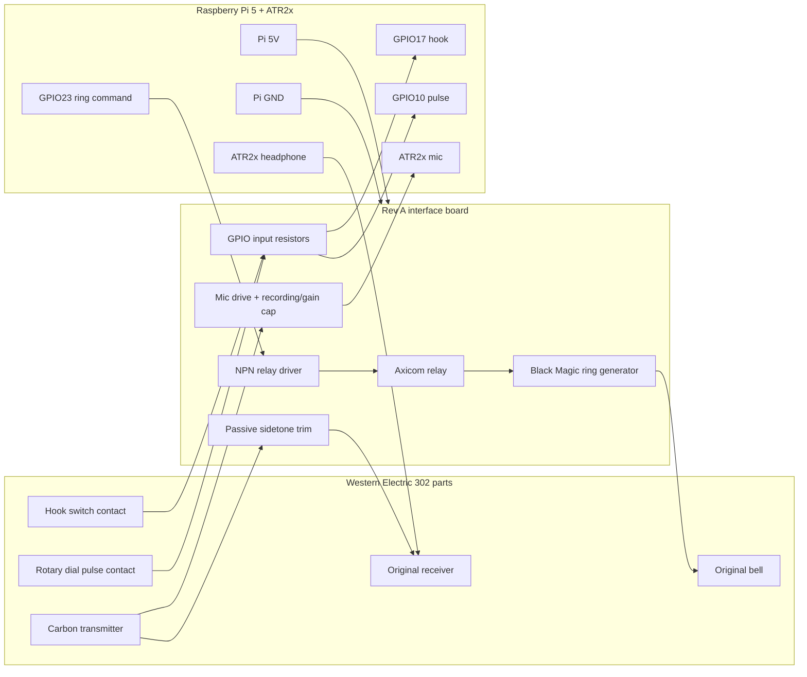

# WE302 Operator Rev A Board As-Built

Date: 2026-07-18

This is the rebuild document for the currently working Rev A bench board. It records the design that now has ring, hook, dial pulse, receiver audio, and carbon microphone audio working at the same time.

This document is intentionally practical: if the board were torn down, use this
to rebuild it from scratch. It is a current build document, not a historical
research log.

---

# 1. Current Architecture

Rev A no longer tries to use the original 302 network as the electrical center of the project. The working design treats the Raspberry Pi interface as the new network/central office and directly interfaces with the original electromechanical parts:

- original mechanical bell
- original hook switch / dial contacts
- original receiver
- original carbon transmitter

The old induction-coil/condenser network is bypassed for the Rev A interface signals because it repeatedly loaded and cross-coupled hook, dial, audio, and ring behavior.

## What Is Working

| Function | Working Rev A path |
|---|---|
| Ring | Black Magic ring generator output directly across `L1` and `K` |
| Ring command | Pi GPIO drives NPN relay driver; relay switches Black Magic low-voltage input |
| Hook | `BK-Y` direct GPIO input; on-hook HIGH, off-hook LOW |
| Dial pulse | `BB-Y` direct GPIO input on GPIO10; contact closes to GND during dial return pulses |
| Receiver | ATR2x headphone tip through 220 ohm into `WHITE_RX`; headphone sleeve to red/R common |
| Carbon mic | Pi/board 5V through 220 ohm minimum resistor and 10k mic-drive pot into `BLACK_MIC`; mic recording/gain coupling cap to ATR2x mic input |
| Sidetone | Passive analog sidetone from `BLACK_MIC` through 470uF, 1k pot, and 10 ohm into `WHITE_RX` |
| Board power | Pi 5V header powers relay, mic drive, and Black Magic low-voltage input |

## Prototype Board Clarification

The Arduino is not part of the Rev A build. If an Arduino-style perfboard or shield appears in bench photos, it was only being used as a convenient landing pad for the phone connections.

The permanent board should put the phone screw terminals on the same perfboard as the relay driver, mic interface, GPIO resistors, and Black Magic low-voltage switching. The goal is one stable interface board, not a separate terminal breakout plus a second circuit board.

## Important Rev A Choice

The hardware off-hook ring interlock was abandoned for Rev A. The hook line reads reliably as a Pi logic input, but it did not behave reliably as a current-sinking hardware cutoff node for LED/transistor experiments.

Ring cutoff is therefore a software safety behavior:

```text
if hook goes off-hook:
    immediately turn ring GPIO off
```

---

# 2. Phone Modifications

These are inside the phone, before the interface board.

## Network Bypass For Hook And Dial

The working control signals became clean only after lifting two lines from the original network:

```text
hook line disconnected from GN
dial line disconnected from L1
the two lifted lines jumpered to each other off-terminal
```

The lifted lines are joined to each other on an isolated splice or terminal. They are not returned to `GN` or `L1`.

This produces the clean control map:

```text
Y      = control common, tied to Pi/board GND
BK-Y   = hook input
BB-Y   = dial pulse input
```

Observed logic:

```text
BK-Y hook:
  on-hook  = HIGH at GPIO
  off-hook = LOW at GPIO

BB-Y pulse:
  rest  = HIGH at GPIO through Pi pull-up
  pulse = LOW / gpiozero pressed when BB closes to Y/GND
```

## Audio Bypass

The handset is used directly:

```text
white handset wire = receiver outer
red / R            = shared receiver inner + mic common
black handset wire = carbon mic signal/bias side
```

Known-good receiver test points:

```text
audio across white and R/red common
```

Known-good mic and sidetone topology:

```text
+5V -> 220 ohm -> 10k mic-drive pot as rheostat -> black carbon mic wire
red/R common -------------------------------------------> board GND

black carbon mic wire -> mic recording/gain coupling capacitor -> ATR2x mic tip
ATR2x mic sleeve ---------------------------------------> board GND

black carbon mic wire -> 470uF sidetone cap -> 1k sidetone pot -> 10 ohm -> white receiver wire
```

For the mic recording/gain coupling capacitor, the path is `BLACK_MIC -> cap -> ATR2x mic tip`. If it is electrolytic, the positive/long leg goes toward `BLACK_MIC`.

For the sidetone electrolytic capacitor, the positive/long leg goes toward `BLACK_MIC`; the negative/short leg goes toward the sidetone pot.

Because this design ties handset common and control common into the Pi/board ground, do not reconnect these bypassed lines back into the original 302 network without re-testing. Rev A is a deliberate bypass design.

---

# 3. Board Power

The working bench board is powered from the Raspberry Pi header.

```text
Pi physical pin 2 or 4  (+5V) -> board +5V rail
Pi physical pin 6 or other GND -> board GND rail
```

Board +5V powers:

- relay coil
- Black Magic low-voltage input through the relay contact
- carbon mic adjustable drive/bias network

Board GND ties to:

- relay-driver emitter
- hook/dial common `Y`
- red/R handset common
- ATR2x headphone sleeve/common
- ATR2x mic sleeve/common
- Black Magic low-voltage input GND

Board GND must not tie to either Black Magic high-voltage output lead.

## Decoupling

Recommended for the perfboard build:

```text
0.1uF ceramic across board +5V/GND near relay driver
470uF electrolytic across board +5V/GND near Black Magic low-voltage input
```

The bench test proved Pi 5V works. If the Pi reboots, audio glitches badly, or ringing becomes weak, move only the Black Magic low-voltage input back to a separate 5V supply.

---

# 4. GPIO Pin Map

This document uses the following Rev A pin assignment:

| Function | BCM GPIO | Physical pin | Logic |
|---|---:|---:|---|
| Hook input | GPIO17 | pin 11 | on-hook HIGH, off-hook LOW |
| Dial pulse input | GPIO10 | pin 19 | open at rest, pulse closure to GND |
| Ring relay output | GPIO23 | pin 16 | HIGH energizes relay |
| Board power | 5V | pin 2 or 4 | +5V rail |
| Board ground | GND | pin 6 or any GND | common return |

Current profile uses GPIO10 for dial pulse and GPIO23 for ring.

---

# 5. Human-Readable Schematics

## 5.1 System Block Diagram



## 5.2 Full ASCII Board Diagram

```text
Raspberry Pi / ATR2x side                              WE302 phone side
--------------------------                             ----------------

Pi 5V pin 2/4  --------------------+------------------ board +5V rail
                                   |
                                   +-- relay coil +
                                   |
                                   +-- relay COM  (switches Black Magic +5V)
                                   |
                                   +-- 220R + 10k mic-drive pot --> black handset wire
                                   |
                                   +-- optional 470uF + 0.1uF decoupling to GND

Pi GND pin 6 ----------------------+------------------ board GND rail
                                   |
                                   +------------------ Y control common
                                   |
                                   +------------------ red/R handset common
                                   |
                                   +------------------ ATR2x mic sleeve/common
                                   |
                                   +------------------ Black Magic low-voltage GND


HOOK INPUT

GPIO17 physical pin 11 ---- 1k ---- BK
board GND ------------------------- Y

Logic:
  on-hook  = GPIO17 HIGH
  off-hook = GPIO17 LOW


DIAL PULSE INPUT

GPIO10 physical pin 19 ---- 1k ---- BB
board GND ------------------------- Y

Logic:
  rest  = HIGH through Pi pull-up
  pulse = LOW / gpiozero pressed when BB closes to Y/GND


RING RELAY DRIVER

GPIO23 physical pin 16 ---- 1k ---- Q1 base
Q1 emitter ------------------------ board GND
Q1 collector ---------------------- relay coil -
relay coil + ---------------------- board +5V

Flyback diode across relay coil:
  diode cathode / stripe ---------- relay coil + / +5V
  diode anode --------------------- relay coil - / Q1 collector


BLACK MAGIC LOW-VOLTAGE POWER SWITCH

board +5V ------------------------- relay COM
relay NO -------------------------- Black Magic +5V input
board GND ------------------------- Black Magic GND input

Relay NC is unused.


BLACK MAGIC HIGH-VOLTAGE OUTPUT

Black Magic HV OUT 1 -------------- L1
Black Magic HV OUT 2 -------------- K

Neither HV output lead connects to board GND.


RECEIVER AUDIO

ATR2x headphone tip  ---- 220R ---- WHITE_RX / white handset wire
ATR2x headphone sleeve ------------ red/R handset common


CARBON MIC AUDIO AND SIDETONE

board +5V ---- 220R ---- 10k mic-drive pot ---- BLACK_MIC / black handset wire
red/R common ----------------------------------- board GND

BLACK_MIC ---- mic recording/gain coupling capacitor ---- ATR2x mic tip
ATR2x mic sleeve ------------------------------ board GND

BLACK_MIC ---- 470uF sidetone capacitor ---- 1k sidetone pot ---- 10R ---- WHITE_RX

If electrolytic capacitor:
  mic recording/gain cap + -> BLACK_MIC
  mic recording/gain cap - -> ATR2x mic tip
  sidetone cap +  -> BLACK_MIC
  sidetone cap -  -> sidetone pot
```

## 5.3 Relay Driver Schematic

```text
                         +5V
                          |
                          |
                    relay coil
                          |
                          +--------- diode anode
                          |          diode cathode/stripe to +5V
                          |
                       Q1 collector
Pi GPIO23 -- 1k -- Q1 base
                       Q1 emitter
                          |
                         GND
```

Notes:

- Q1 is a PN2222A / 2N2222-style NPN.
- Verify your exact transistor pinout before soldering.
- Relay contact must use NO so failure/default state is no ring.

## 5.4 Ring Generator Switching

```text
Low-voltage side:

board +5V ---- relay COM
relay NO ----- Black Magic +5V input
board GND ---- Black Magic GND input


High-voltage side:

Black Magic OUT1 ---- L1
Black Magic OUT2 ---- K
```

The relay switches the Black Magic input power, not the high-voltage ring output.

## 5.5 Hook And Dial Inputs

```text
                 internal Pi pull-up
                         |
GPIO17 ---- 1k ---- BK --o/ o---- Y ---- GND
                  hook contact


                 internal Pi pull-up
                         |
GPIO10 ---- 1k ---- BB --o/ o---- Y ---- GND
                  dial pulse contact
```

Observed behavior:

```text
BK hook:
  on-hook  HIGH
  off-hook LOW

BB pulse:
  rest  HIGH
  pulse LOW / gpiozero pressed
```

## 5.6 Receiver, Carbon Mic, And Sidetone

```text
Receiver:

ATR2x headphone tip/signal ---- 220R ---- WHITE_RX / white receiver wire
ATR2x headphone sleeve/common ---------- red/R common


Carbon mic drive and recording:

board +5V ---- 220R ---- 10k mic-drive pot ---- BLACK_MIC / black mic wire
red/R common ----------------------------------- board GND

BLACK_MIC ---- mic recording/gain coupling cap ---- ATR2x mic tip
ATR2x mic sleeve ---------------------------------- board GND


Passive analog sidetone:

BLACK_MIC ---- 470uF ---- 1k sidetone pot ---- 10R ---- WHITE_RX
```

Mic-drive pot wiring:

```text
board +5V -> 220R -> pot outer lug A
pot middle/wiper -> BLACK_MIC
pot outer lug B  -> jumper to middle/wiper
```

This makes the 10k pot act as an adjustable series resistance, with the 220 ohm resistor as the minimum safe resistance.

Sidetone pot wiring:

```text
BLACK_MIC -> 470uF cap + / long leg
470uF cap - / short leg -> pot outer lug A
pot middle/wiper --------> 10R -> WHITE_RX
pot outer lug B ---------> jumper to middle/wiper
```

This makes the 1k pot act as an adjustable sidetone series resistance. Start with maximum resistance, then turn it down by ear until your own voice is present but not distracting.

Electrolytic polarity:

```text
mic recording/gain coupling cap + -> BLACK_MIC
mic recording/gain coupling cap - -> ATR2x mic tip

sidetone 470uF cap + -> BLACK_MIC
sidetone 470uF cap - -> sidetone pot
```

Bench-confirmed current audio values:

```text
ATR2x headphone tip to WHITE_RX: 220 ohm
mic recording/gain cap:          BLACK_MIC -> cap -> ATR2x mic tip
sidetone cap:                   470uF electrolytic
sidetone pot:                   1k, wired as rheostat
sidetone minimum resistor:      10 ohm
mic-drive minimum resistor:     220 ohm
mic-drive pot:                  10k, wired as rheostat
```

The carbon mic records clearly with the adjustable drive control. Some background hiss is expected from the carbon transmitter and USB mic preamp.

---

# 6. Software Logic

## Hook

```python
from gpiozero import Button

hook = Button(17, pull_up=True, bounce_time=0.03)

on_hook = not hook.is_pressed
off_hook = hook.is_pressed
```

## Dial Pulse

The pulse contact is open at rest and closes to `Y/GND` during dial return. Use a Pi internal pull-up and count closure events.

```python
from gpiozero import Button

pulse = Button(10, pull_up=True, bounce_time=0.02)
pulse.when_pressed = count_pulse
```

## Ring

```python
from gpiozero import OutputDevice

ring = OutputDevice(23, active_high=True, initial_value=False)

def stop_ring_if_off_hook():
    if hook.is_pressed:
        ring.off()
```

Ring cutoff is software controlled in Rev A:

```text
ring command ON + hook remains on-hook -> relay energized
hook goes off-hook                    -> ring GPIO LOW immediately
ring command OFF                      -> relay de-energized
```

---

# 7. Agent-Readable Net Summary

The canonical machine-readable netlist lives in:

```text
rev_a_board_netlist.yaml
```

Short form:

```text
NET_BOARD_5V:
  Pi 5V, relay coil +, relay COM, mic-drive resistor/pot, decoupling +

NET_BOARD_GND:
  Pi GND, Y, red/R common, Q1 emitter, Black Magic input GND,
  ATR2x mic sleeve, decoupling -

NET_HOOK_BK:
  GPIO17 through 1k, BK

NET_PULSE_BB:
  GPIO10 through 1k, BB

NET_RING_CMD:
  GPIO23 through 1k, Q1 base

NET_RELAY_LOW:
  relay coil -, Q1 collector, flyback diode anode

NET_BM_5V_SWITCHED:
  relay NO, Black Magic +5V input

NET_RING_HV_A:
  Black Magic HV OUT1, L1

NET_RING_HV_B:
  Black Magic HV OUT2, K

NET_RX_SIGNAL:
  ATR2x headphone tip, 220 ohm series resistor, WHITE_RX / white handset wire

NET_MIC_BIASED_BLACK:
  BLACK_MIC / black handset wire, mic-drive pot output,
  mic recording/gain coupling cap input, sidetone 470uF cap positive side

NET_SIDETONE_AC:
  sidetone 470uF cap negative side, sidetone pot input

NET_SIDETONE_TO_RX:
  sidetone pot wiper/tied lug, 10 ohm resistor, WHITE_RX
```

---

# 8. Perfboard Migration Plan

## 8.1 Layout Zones

Use physical zones on the perfboard:

```text
[Pi header] [GPIO resistors + relay driver] [relay] [Black Magic low V]

[audio terminals + mic bias]                 [phone terminal block]

[Black Magic HV output / bell terminals at edge, physically separated]
```

Keep the high-voltage ring output at one edge of the board. Do not route ring output under GPIO or audio wiring.

## 8.2 Recommended Terminal Blocks

The bench harness uses 8-conductor thermostat wire from the phone. The cable is mechanically awkward, so the screw terminals are part of the design rather than a temporary convenience. Put them on the permanent board.

Phone terminal block:

| Terminal | Goes to |
|---|---|
| `Y` | control common / board GND |
| `BK` | hook input |
| `BB` | pulse input |
| `L1` | Black Magic HV OUT1 |
| `K` | Black Magic HV OUT2 |
| `WHITE_RX` | receiver signal |
| `RED_R_COMMON` | receiver/mic common |
| `BLACK_MIC` | carbon mic signal/bias |

If only eight phone conductors are available, the expected permanent harness allocation is:

| Conductor | Function |
|---|---|
| 1 | `Y` control/audio common |
| 2 | `BK` hook |
| 3 | `BB` pulse |
| 4 | `L1` ring HV side A |
| 5 | `K` ring HV side B |
| 6 | `WHITE_RX` receiver signal |
| 7 | `RED_R_COMMON` handset common |
| 8 | `BLACK_MIC` carbon mic signal/bias |

This works because Rev A does not need the original `L2`, `GN`, old network terminals, or a separate hardware ring-trip wire.

Pi/control terminal block:

| Terminal | Goes to |
|---|---|
| `PI_5V` | Pi physical pin 2 or 4 |
| `PI_GND` | Pi ground |
| `GPIO17_HOOK` | Pi physical pin 11 |
| `GPIO10_PULSE` | Pi physical pin 19 |
| `GPIO23_RING` | Pi physical pin 16 |

Audio terminal block or cable tie points:

| Terminal | Goes to |
|---|---|
| `HP_TIP` | ATR2x headphone tip |
| `HP_SLEEVE` | ATR2x headphone sleeve |
| `MIC_TIP` | ATR2x mic tip |
| `MIC_SLEEVE` | ATR2x mic sleeve / board GND |

## 8.3 Build Order

1. Install Pi power and ground terminals.
2. Add +5V/GND rails on perfboard.
3. Add decoupling capacitors across +5V/GND.
4. Build relay driver only.
5. Test relay click from GPIO23 with relay contacts disconnected.
6. Wire relay NO contact to switch Black Magic low-voltage +5V.
7. Test Black Magic power switching with HV output disconnected.
8. Connect Black Magic HV output to `L1/K`; verify bell rings.
9. Add hook input `BK -> 1k -> GPIO17`; verify hook.
10. Add pulse input `BB -> 1k -> GPIO10`; verify pulse count.
11. Add receiver audio path with 220 ohm series resistor; verify playback at low volume.
12. Add carbon mic drive and mic recording/gain coupling cap; verify recording.
13. Add passive sidetone branch; start at minimum sidetone and tune by ear.
14. Run full flow: ring, answer, ring stops by software, play audio, record mic, sidetone, dial.

## 8.4 Mechanical Recommendations

- Use screw terminals or fork/ring lugs for all phone wires.
- Mount the phone screw terminals on the same permanent perfboard as the interface circuit.
- Do not include the Arduino in the permanent build; any Arduino board in bench photos was only a temporary terminal landing pad.
- Label every lifted phone wire before final soldering.
- Use strain relief for the cable leaving the phone.
- Treat the 8-conductor thermostat wire as the phone harness and anchor it mechanically before it reaches the screw terminals.
- Keep Black Magic HV output wires twisted together and away from GPIO/audio.
- Leave the relay NC contact unused.
- Prefer a socket or accessible footprint for Q1 if the transistor pinout is uncertain.
- Put the flyback diode physically close to the relay coil pins.
- Keep the carbon mic coupling capacitor close to the audio input wiring.

## 8.5 Perfboard Safety Checklist

Before powering:

- No Black Magic HV output lead has continuity to board GND.
- No GPIO pin has continuity to +5V.
- Relay coil has a flyback diode in the correct direction.
- Relay contact is NO, not NC.
- `Y` has continuity to board GND.
- `BK` does not have continuity to board GND on-hook.
- `BK` has continuity to board GND off-hook.
- `BB` shows the expected pulse behavior when dialing.
- Black Magic low-voltage input polarity is correct.
- Red/R handset common only goes where Rev A expects; it is not accidentally reconnected to the old network.
- ATR2x headphone tip reaches `WHITE_RX` only through the 220 ohm series resistor.
- Mic recording/gain coupling cap is in series from `BLACK_MIC` to ATR2x mic tip; if electrolytic, positive faces `BLACK_MIC`.
- Sidetone 470uF capacitor polarity is correct: positive to `BLACK_MIC`, negative to the sidetone pot.
- Sidetone pot starts at maximum resistance before first audio test.

---

# 9. Open-Source Diagram Files

Two external diagram files are included:

```text
rev_a_board_mermaid.mmd
rev_a_board_graphviz.dot
```

Render Mermaid with the Mermaid CLI:

```bash
mmdc -i rev_a_board_mermaid.mmd -o rev_a_board_mermaid.svg
```

Render Graphviz:

```bash
dot -Tsvg rev_a_board_graphviz.dot -o rev_a_board_graphviz.svg
```

The Markdown diagrams in this file are the human-readable source of truth. The YAML netlist is the agent-readable source of truth.

---

# 10. Known Good Bench State

Use this as the final sanity check:

```text
Ring:
  GPIO23 HIGH -> relay energizes -> Black Magic powers on -> bell rings on L1/K

Hook:
  GPIO17 HIGH -> on-hook
  GPIO17 LOW  -> off-hook

Pulse:
  GPIO10 rests HIGH and pulses LOW / gpiozero pressed during dial return

Audio out:
  ATR2x headphone tip -> 220 ohm -> WHITE_RX
  ATR2x headphone sleeve -> red/R common
  clear tone/audio through original receiver

Mic:
  +5V through 220 ohm + 10k mic-drive pot into black carbon mic wire
  red/R common to ground
  black through mic recording/gain coupling cap to ATR2x mic tip
  recording works, with expected background hiss

Sidetone:
  BLACK_MIC -> 470uF -> 1k sidetone pot -> 10 ohm -> WHITE_RX
  subtle but audible local voice in receiver, tuned by ear
```
