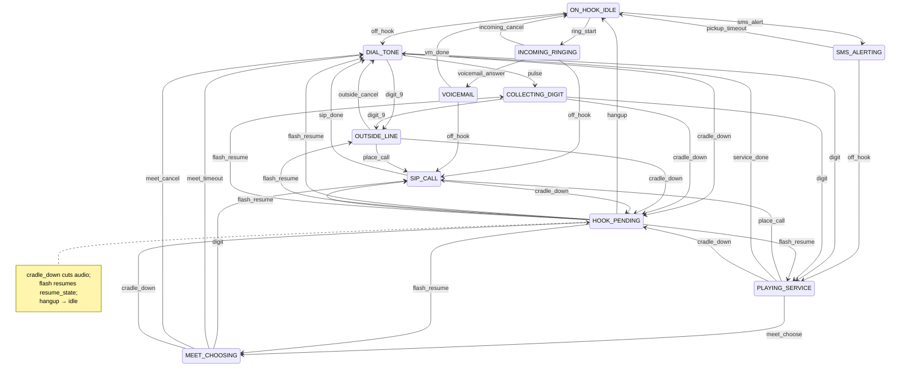

# Telephone state chart

Generated from `operator_os.state.CHART_EDGES` — do not hand-edit the diagram.
Regenerate with `just chart`.

Rules:

- Named states own the plant. Each state has a cordboard patch (`operator_os.plant.STATE_PATCH`); see `docs/audio-line.md`.
- New capabilities = chart states/edges + patch rows — not ALSA hacks in feature code.
- Cradle down enters `HOOK_PENDING` (silence first); flash vs hangup is decided after the cut.
- If a bug story is a race, queue order, or “forgot to stop audio,” the chart or patch table is wrong.

